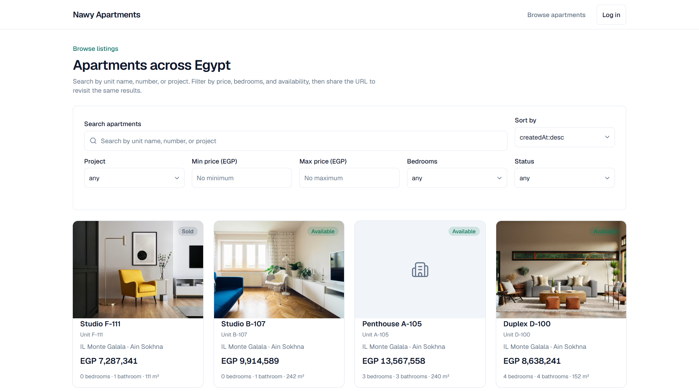
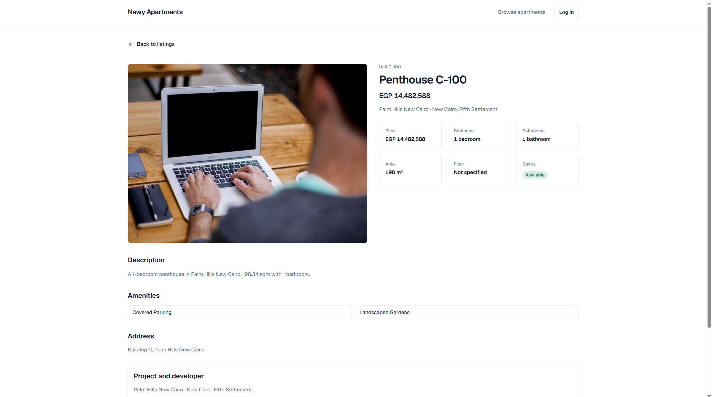
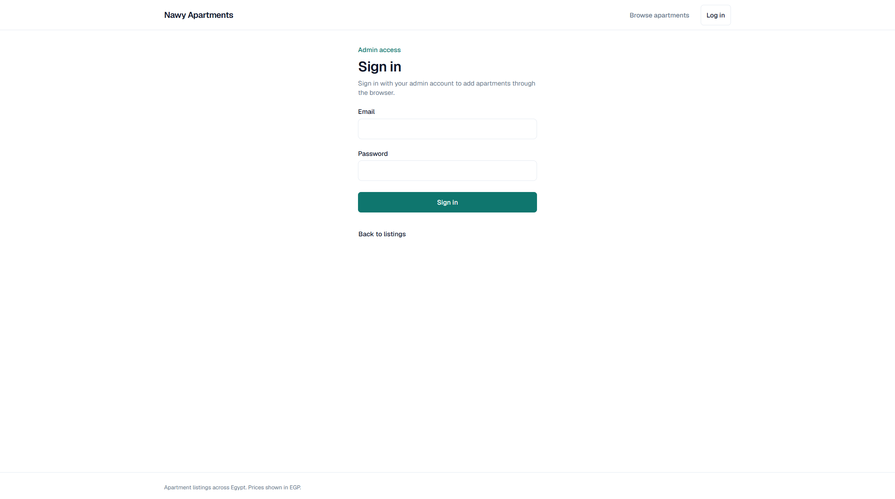

# Listing Apartments App

A full-stack apartment listing application built for the Nawy Software Engineer take-home assignment. Browse seeded listings with search, filters, sorting, and pagination; open detail pages; and log in as an admin to add apartments through the browser.

| Listing                                                               | Details                                                 | Admin login                                       |
| --------------------------------------------------------------------- | ------------------------------------------------------- | ------------------------------------------------- |
|  |  |  |

## Prerequisites

**Docker quick start**

- Docker Engine and Docker Compose v2
- Git

No local Node.js install is required for the Docker path.

**Local development without Docker**

- Node.js **24.x** and npm (matching root `engines`)
- PostgreSQL **18** reachable on localhost
- Git

## Quick start

From a fresh clone:

```bash
git clone <repository-url>
cd listing-apartments-app
cp .env.example .env
docker compose up
```

On Windows **Command Prompt**, use `copy` instead of `cp`:

```cmd
git clone <repository-url>
cd listing-apartments-app
copy .env.example .env
docker compose up
```

The first run builds images, starts PostgreSQL, runs migrations, seeds data, and brings up the API and web app. Startup typically takes a few minutes on a cold build.

When containers are healthy:

| Service      | URL                            |
| ------------ | ------------------------------ |
| Web app      | http://localhost:3000          |
| API          | http://localhost:4000/api/v1   |
| Swagger UI   | http://localhost:4000/api/docs |
| Health check | http://localhost:4000/health   |

### Seeded admin account

The idempotent seed creates an `ADMIN` user from environment variables. Defaults in [`.env.example`](.env.example):

| Variable         | Default            |
| ---------------- | ------------------ |
| `ADMIN_EMAIL`    | `admin@nawy.local` |
| `ADMIN_PASSWORD` | `change-me-too`    |

Change both values in `.env` before any non-local deployment. After changing credentials, restart the stack so the API picks up the new env; the seed only creates the admin row when it does not already exist (it does not rotate an existing password on every run).

### Seeded catalogue

On first startup the database contains:

- 5 developers
- 10 projects (two per developer)
- 40 apartments (four per project; additional apartments may exist if E2E tests have run against the same volume)

### Tear down and cold start

To verify a clean bootstrap (wipes the database volume):

```bash
docker compose down -v
docker compose up
```

### Port conflicts

If port `5432` is already in use on your machine, set `POSTGRES_PORT=5433` (or another free port) in `.env` before `docker compose up`.

### Development mode with hot reload

```bash
docker compose -f docker-compose.yml -f docker-compose.dev.yml up
```

Bind mounts and watch mode apply to `apps/api` and `apps/web` while still using the Compose PostgreSQL service.

## Tech stack

Resolved versions come from `package-lock.json` at install time.

| Layer          | Technology                           | Version       |
| -------------- | ------------------------------------ | ------------- |
| Runtime        | Node.js                              | 24.x LTS      |
| Language       | TypeScript                           | 5.9.3         |
| Backend        | NestJS                               | 10.4.22       |
| ORM            | TypeORM                              | 0.3.31        |
| Database       | PostgreSQL (Alpine)                  | 18            |
| Frontend       | Next.js (App Router)                 | 16.3.1        |
| UI             | React, Tailwind CSS, shadcn/ui       | 19.2.8, 4.3.3 |
| Shared types   | `@apartments/shared` (npm workspace) | —             |
| Auth           | JWT + Passport, bcrypt cost 12       | —             |
| API docs       | Swagger UI at `/api/docs`            | —             |
| Backend tests  | Jest + Supertest (real PostgreSQL)   | —             |
| Frontend tests | Vitest + React Testing Library       | 4.1.11        |
| E2E            | Playwright (Chromium)                | 1.62.1        |
| Containers     | Docker Compose                       | —             |

Authoritative scope and API contracts live in [docs/requirements.md](docs/requirements.md). The phased build history is in [docs/implementation-plan.md](docs/implementation-plan.md).

## API endpoints

Base path: `/api/v1`. Full request/response shapes, validation rules, and status codes are documented in Swagger and frozen in [docs/requirements.md](docs/requirements.md) section 7.

| Method   | Path                     | Auth         | Description                                            |
| -------- | ------------------------ | ------------ | ------------------------------------------------------ |
| `GET`    | `/health`                | Public       | Process and database health (outside versioned prefix) |
| `GET`    | `/api/v1/apartments`     | Public       | List apartments with search, filters, sort, pagination |
| `GET`    | `/api/v1/apartments/:id` | Public       | Apartment detail                                       |
| `POST`   | `/api/v1/apartments`     | ADMIN        | Create apartment                                       |
| `PATCH`  | `/api/v1/apartments/:id` | ADMIN        | Update apartment                                       |
| `DELETE` | `/api/v1/apartments/:id` | ADMIN        | Soft delete apartment                                  |
| `GET`    | `/api/v1/projects`       | Public       | Projects for filter dropdown                           |
| `GET`    | `/api/v1/developers`     | Public       | Developers list                                        |
| `POST`   | `/api/v1/auth/login`     | Public       | Obtain JWT access token                                |
| `GET`    | `/api/v1/auth/me`        | Bearer token | Validate token and return current user                 |

Interactive documentation: **http://localhost:4000/api/docs**

## Local development without Docker

1. Install dependencies:

   ```bash
   npm install
   ```

2. Copy and adjust environment:

   ```bash
   cp .env.example .env
   ```

   For a local PostgreSQL instance, set at minimum:

   ```env
   POSTGRES_HOST=localhost
   POSTGRES_PORT=5432
   POSTGRES_DB=apartments
   POSTGRES_USER=apartments
   POSTGRES_PASSWORD=apartments_dev_password
   ```

3. Create the database (once), then migrate and seed:

   ```bash
   npm run -w apps/api migration:run
   npm run -w apps/api seed
   ```

4. Start both apps from the repository root:

   ```bash
   npm run dev
   ```

   - Web: http://localhost:3000
   - API: http://localhost:4000

Integration tests use a separate database (`apartments_test`). With PostgreSQL running and `.env` pointing at it, Jest global setup creates that database automatically before the suite runs.

## Testing

Run from the repository root unless noted.

| Suite            | Command                                | Notes                                                                 |
| ---------------- | -------------------------------------- | --------------------------------------------------------------------- |
| Lint             | `npm run lint`                         | ESLint across workspaces                                              |
| Typecheck        | `npm run typecheck`                    | Builds `packages/shared`, then `tsc` / `next typegen`                 |
| Unit tests       | `npm run test`                         | API service unit tests; web component tests (Vitest)                  |
| API integration  | `npm run -w apps/api test:integration` | Supertest against real PostgreSQL (`apartments_test`)                 |
| E2E (Playwright) | `npm run -w apps/web test:e2e`         | Requires the Compose stack (or equivalent) at `http://localhost:3000` |

Playwright installs Chromium automatically via the `pretest:e2e` script on first run.

**CI:** [`.github/workflows/ci.yml`](.github/workflows/ci.yml) runs on pushes and pull requests to `dev` and `main` (lint, typecheck, unit tests, API integration tests with a PostgreSQL 18 service container).

**Manual E2E workflow:** [`.github/workflows/e2e.yml`](.github/workflows/e2e.yml) is triggered manually from the GitHub Actions tab (`workflow_dispatch`). It runs `docker compose up`, waits for health checks, and executes Playwright against the live stack.

## Project structure

```
listing-apartments-app/
├── apps/
│   ├── api/          NestJS API (modules, auth, TypeORM, migrations, seeds, integration tests)
│   └── web/          Next.js App Router frontend (listing, details, login, add form, E2E)
├── packages/
│   └── shared/       Shared enums, types, and zod schemas for API + web
├── docs/
│   ├── requirements.md        Single source of truth for scope and API contract
│   ├── implementation-plan.md Phased build plan
│   └── ui-guidelines.md       Frontend design tokens and layout conventions
├── docker-compose.yml         Production-like single-command startup
├── docker-compose.dev.yml     Hot-reload override
└── .env.example               Documented environment defaults (copy to `.env`)
```

Backend layering follows **Controller → Service → Repository → TypeORM**. Shared contracts are imported from `packages/shared`, not re-declared per app.

## Known limitations and deliberate omissions

The following are intentionally **not** implemented (see [docs/requirements.md](docs/requirements.md) section 2.3):

- File or image upload (images are external URLs only)
- Refresh tokens, token rotation, or token blocklists
- Public registration or roles other than `ADMIN`
- Internationalization, Arabic content, or RTL layout
- Geospatial search, maps, or PostGIS
- WebSockets or real-time updates
- Favourites, comparisons, bookings, contact forms, or outbound email
- Admin dashboard beyond the single add-apartment form
- Redis caching, message brokers, or background job queues

## Definition of done

Checklist from [docs/requirements.md](docs/requirements.md) section 10:

- [x] `docker compose up` on a fresh clone (after `cp .env.example .env`) produces a working, populated app with no further manual steps
- [x] All ten API endpoints in section 7 behave as specified, including listed status codes
- [x] Search, filters, sorting, and pagination work in combination on the listing page
- [x] Listing and details pages are usable from 320px through desktop
- [x] Every endpoint has an integration test; business rules cite `BR-*` in test names
- [x] No skipped or commented-out tests
- [x] Swagger UI at `/api/docs` documents every endpoint, including error shapes
- [x] Lint, typecheck, and the full test suite pass in CI
- [x] README setup instructions documented and verified on this repository
- [x] README documents the omissions in section 2.3

## Further reading

- [docs/requirements.md](docs/requirements.md) — business rules, data model, API contract
- [docs/implementation-plan.md](docs/implementation-plan.md) — phase-by-phase build plan
- [AGENTS.md](AGENTS.md) — conventions for contributors and coding agents
