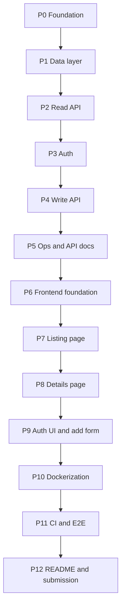

# Implementation Plan — Listing Apartments App

Phases are **dependency-ordered, not date-ordered**. Each phase ends in a state where the repository is runnable and its tests pass; nothing is left half-wired across a phase boundary.

Scope and behavior come from [requirements.md](requirements.md). This file only describes _order of work_ and _exit conditions_. If a phase seems to require something not in `requirements.md`, stop and ask instead of inventing it.

**Rules for working this plan**

- Complete phases in order. A phase may only start when the previous phase's exit condition is met.
- Tests are written alongside the code in the same phase, never deferred to a later one.
- Tick the boxes in this file as work completes, in the same commit as the work.
- One commit per completed phase, using Conventional Commits with a scope.

---

## P0 — Foundation

**Goal:** an empty but fully-wired monorepo where tooling enforces the rules before any feature code exists.

- [x] `package.json` at the root declaring npm workspaces: `apps/*`, `packages/*`
- [x] `apps/api` scaffolded with NestJS 10, `apps/web` scaffolded with Next.js 16 (App Router, TypeScript)
- [x] `packages/shared` for types and enums consumed by both apps
- [x] `tsconfig.base.json` with `strict: true`, extended by every workspace
- [x] ESLint 9 flat config and Prettier, shared across workspaces
- [x] Husky with a pre-commit hook running lint-staged, and commitlint enforcing Conventional Commits
- [x] `.env.example` documenting every variable, with no real secrets
- [x] `.gitignore`, `.dockerignore`
- [x] Root scripts: `lint`, `typecheck`, `test`, `dev`, `build`

**Exit condition:** `npm install`, `npm run lint`, and `npm run typecheck` all pass at the root. A commit with a non-conventional message is rejected by the hook.

---

## P1 — Data layer

**Goal:** the schema from `requirements.md` section 5 exists in PostgreSQL via migrations, populated with realistic data.

- [x] TypeORM `DataSource` configured from validated environment variables, `synchronize: false` permanently
- [x] Snake-case naming strategy so TypeScript stays camelCase while the database stays `snake_case`
- [x] Entities: `Developer`, `Project`, `Apartment`, `User`, with relations per BR-1
- [x] `@DeleteDateColumn` on `deletedAt` for the three domain entities
- [x] Migration enabling the `pg_trgm` extension
- [x] Migration creating all tables, both enum types, and foreign keys with `ON DELETE RESTRICT`
- [x] Migration creating the partial unique index `(project_id, unit_number) WHERE deleted_at IS NULL` (BR-3) and the equivalent on `projects` and `developers`
- [x] Migration creating the GIN trigram indexes and the btree indexes listed in section 5.3
- [x] Check constraints for `price > 0`, `area_sqm > 0`, `bedrooms >= 0`, `bathrooms >= 0` (BR-15)
- [x] Idempotent seed script: ~5 developers, ~10 projects, ~40 apartments, plus one ADMIN user whose password comes from the environment
- [x] `npm run migration:run`, `migration:revert`, `migration:generate`, `seed` scripts

**Tests:** an integration test proving the partial unique index rejects a duplicate live unit number but permits reuse after a soft delete (BR-3, BR-7).

**Exit condition:** migrations apply to an empty database and revert cleanly. Running the seed twice produces the same row counts.

---

## P2 — Read API

**Goal:** both required read endpoints, fully specified and fully tested.

- [x] `ApartmentsModule` with controller, service, and repository, respecting the one-directional layering
- [x] `GET /api/v1/apartments` with `q`, `projectId`, `minPrice`, `maxPrice`, `bedrooms`, `status`, `sort`, `page`, `limit` (sections 7.2, BR-8 to BR-14)
- [x] `GET /api/v1/apartments/:id` returning `ApartmentDetail` with nested project and developer (7.3)
- [x] `GET /api/v1/projects` and `GET /api/v1/developers` with their counts (7.7, 7.8)
- [x] Query DTOs with `class-validator` and `class-transformer`; global `ValidationPipe` with `whitelist`, `forbidNonWhitelisted`, `transform` (BR-23)
- [x] Explicit mappers producing DTOs; no entity ever returned from a controller
- [x] Global exception filter emitting the exact error shape from 7.1
- [x] Pagination envelope from 7.1, applied via a reusable response type
- [x] Global prefix `/api/v1`

**Tests:**

- [x] Unit tests for the service covering BR-8 through BR-14, each citing its BR number
- [x] Integration tests for all four endpoints against a real PostgreSQL instance, including: combined `q` plus filters, whitespace-only `q` being ignored, `page` past the end returning empty `data` with correct `meta`, `minPrice > maxPrice` returning 400, unknown query parameter returning 400, soft-deleted apartment returning 404

**Exit condition:** every case above passes against real PostgreSQL. SQLite is not an acceptable substitute; partial indexes and `ILIKE` semantics must be genuinely exercised.

**Note:** `GET /projects` and `GET /developers` return `{ "data": [...] }` with no `meta` key — confirmed with the user, since section 7.1's pagination `meta` (`page`/`limit`/`total`/`totalPages`) doesn't apply to these explicitly "not paginated" endpoints.

---

## P3 — Authentication

**Goal:** an ADMIN can obtain a token; nothing is protected yet.

- [x] `AuthModule` with `@nestjs/jwt` and a Passport JWT strategy
- [x] `POST /api/v1/auth/login` (7.9) returning `{ accessToken, expiresIn, user }`
- [x] `GET /api/v1/auth/me` (7.10)
- [x] `bcrypt` cost 12 for hashing and comparison (BR-21)
- [x] Identical failure response for unknown email and wrong password (BR-22)
- [x] `JwtAuthGuard` and a `RolesGuard` with an `@Roles(...)` decorator, returning 401 versus 403 correctly (BR-19)
- [x] `@nestjs/throttler`: 100/min globally, 5/min on login
- [x] JWT secret and expiry read from validated environment variables; the process refuses to start without a secret

**Tests:**

- [x] login success; wrong password and unknown email producing byte-identical responses; expired token rejected with 401; `passwordHash` absent from every response body (BR-21); login rate limit returning 429 on the sixth attempt
- [x] `RolesGuard` unit tests (BR-19) — no route uses `@Roles(...)` yet, so its 401-vs-403 role comparison is proven directly rather than through a real protected endpoint

**Exit condition:** a token can be obtained and verified, and no response anywhere leaks a hash.

**Note:** `JWT_EXPIRES_IN` is parsed to whole seconds at the environment-validation boundary (accepts `"1h"`, `"30m"`, `"3600s"`, or a bare number of seconds) rather than passed through as a string — `@nestjs/config` writes the _validated_ value back into `process.env`, so the parser has to tolerate its own numeric output being re-parsed later in the same process (notably by the standalone TypeORM CLI/tests).

---

## P4 — Write API

**Goal:** the required add endpoint plus update and soft delete, all ADMIN-protected.

- [x] `POST /api/v1/apartments` (7.4), guarded, returning 201 with `ApartmentDetail`
- [x] `PATCH /api/v1/apartments/:id` (7.5), guarded, requiring at least one field
- [x] `DELETE /api/v1/apartments/:id` (7.6), guarded, soft delete returning 204
- [x] Referential check on `projectId` returning 422 (BR-2)
- [x] Duplicate unit number returning 409, translating the database index violation into a readable message (BR-3)
- [x] All reads confirmed to exclude soft-deleted rows after a delete (BR-5)

**Tests:**

- [x] create success; create with a non-existent `projectId` returning 422; duplicate live unit number returning 409; same unit number accepted after the original is soft-deleted (BR-7); unauthenticated write returning 401; deleted apartment absent from list and returning 404 on details; second delete returning 404 (BR-6); partial update leaving untouched fields unchanged
- [x] a valid non-ADMIN token returning 403 (BR-19), a projectId move on `PATCH` re-validated against BR-2/BR-3, and unknown body properties / non-http(s) `imageUrls` rejected with 400

**Exit condition:** every endpoint in section 7 exists, matches the contract, and has integration coverage.

**Note:** `CreateApartmentDto`/`UpdateApartmentDto` deliberately have no field initializers. Under this repo's `tsconfig` (`target: ES2022`), `useDefineForClassFields` defaults to true, so every declared class field — even an unset optional one — becomes its own property equal to `undefined` once `class-transformer` builds the DTO. `ApartmentsService.update` and `mappers/apartment.mapper.ts#toApartmentUpdateData` check each field against `undefined` explicitly rather than trusting `Object.keys(dto)` or spreading the DTO into the repository update, which would otherwise silently NULL every field the client left untouched.

---

## P5 — Operations and API documentation

**Goal:** the backend is documented and observable.

- [x] `@nestjs/swagger` at `/api/docs`, documenting every endpoint including error responses and enum values
- [x] DTOs annotated so the generated schema is accurate rather than merely present
- [x] `nestjs-pino` structured JSON logging with a per-request correlation ID, with tokens and hashes redacted
- [x] `GET /health` via `@nestjs/terminus` including a database connectivity check (7.11)
- [x] CORS restricted to an explicit origin allowlist from the environment
- [x] `helmet` for baseline security headers
- [x] `enableShutdownHooks` for graceful `SIGTERM` handling

**Tests:**

- [x] `GET /health` returns 200 when PostgreSQL is reachable; returns 503 with Terminus `{ status: 'error', ... }` body when the database indicator fails

**Exit condition:** `/api/docs` documents all ten endpoints and can drive a successful authenticated `POST` from the browser. `/health` returns 503 when the database is unreachable.

**Notes:**

- `DatabaseHealthIndicator` wraps the app's existing TypeORM `DataSource` (`SELECT 1`) rather than Terminus's `TypeOrmHealthIndicator`, which performs a separate `@nestjs/typeorm` package-resolution check that fails in this npm-workspaces layout even though TypeORM is configured and running.
- Terminus health-check failures use the `{ status, info, error, details }` body (7.11), not section 7.1 — `AllExceptionsFilter` passes that shape through unchanged.
- `class-validator` and `class-transformer` are also declared at the workspace root so hoisted `@nestjs/common` can resolve them for `ValidationPipe` (npm workspaces hoist `@nestjs/*` to the root but not every app dependency).

---

## P6 — Frontend foundation

**Goal:** the shell, the design system, and one real end-to-end data path.

- [ ] Tailwind CSS 4 configured, with design tokens for colour, spacing, and radius
- [ ] shadcn/ui initialized with only the components actually needed
- [ ] Root layout: header, footer, font loading, metadata
- [ ] Typed API client with a server-side variant using the internal Docker hostname and a browser variant using the public URL
- [ ] Request and response types imported from `packages/shared`, never redeclared
- [ ] EGP currency and number formatting helpers
- [ ] Error boundary and `not-found` handling at the app level

**Tests:** unit tests for the formatting helpers and for the API client's error mapping.

**Exit condition:** a placeholder page renders real apartment data fetched from the running API.

---

## P7 — Listing page

**Goal:** the primary page, including the bonus requirement.

- [ ] `/` renders the first paint as a Server Component reading filters from `searchParams`
- [ ] Responsive card grid: 1 column, 2 at `md`, 3 at `lg`, 4 at `xl`
- [ ] Card shows cover image with placeholder fallback, unit name, unit number, project, city, price, bedrooms, bathrooms, area, status badge
- [ ] Search input, debounced 400ms, writing `q` to the URL
- [ ] Filters for project, price range, bedrooms, and status, collapsing behind a disclosure on mobile
- [ ] Sort control covering the values in BR-13
- [ ] Pagination control reflecting `meta`, with `page` in the URL
- [ ] Loading skeletons matching the final card layout
- [ ] Distinct empty state and error state; a failed request must never look like zero results
- [ ] URL is the single source of UI state, so results are shareable and survive refresh and back-navigation

**Tests:** component tests for the search input's debounce and URL writing, the empty state, and the error state.

**Exit condition:** search, every filter, sort, and pagination all work in combination, and the page is correct from 320px upward.

---

## P8 — Details page

**Goal:** the second required page.

- [ ] `/apartments/[id]` as a Server Component
- [ ] Image gallery with thumbnail navigation and a placeholder when `imageUrls` is empty
- [ ] Specification grid: price, bedrooms, bathrooms, area, floor, status
- [ ] Description, amenities list, address
- [ ] Project and developer information, with a link back to the listing filtered by that project
- [ ] `notFound()` for a missing or soft-deleted apartment
- [ ] Per-apartment page metadata for shareable links
- [ ] Responsive layout, single column on mobile

**Tests:** a component test for the gallery's empty-image fallback.

**Exit condition:** details render correctly for an apartment with many images and for one with none; an unknown ID renders the 404 page.

---

## P9 — Auth UI and add-apartment form

**Goal:** the add capability is usable through the UI, not just the API.

- [ ] `/login` page posting to `POST /api/v1/auth/login`
- [ ] Access token held client-side and attached as `Authorization: Bearer` on mutating requests
- [ ] Token validated on load via `GET /api/v1/auth/me`, clearing it if rejected
- [ ] Client-side guard redirecting `/apartments/new` to `/login` when unauthenticated
- [ ] `/apartments/new` form using react-hook-form with a zod schema derived from the same shared types the API validates against
- [ ] Project select populated from `GET /api/v1/projects`
- [ ] Inline field errors, plus server-side 409 and 422 surfaced against the relevant field rather than as a bare toast
- [ ] Submit disabled while in flight; success redirects to the new apartment's details page
- [ ] Header reflects authentication state and offers logout

**Tests:** component tests for validation errors, for the 409 duplicate case mapping onto the `unitNumber` field, and for the unauthenticated redirect.

**Exit condition:** an apartment can be created start to finish through the browser and appears in the listing.

---

## P10 — Dockerization

**Goal:** the assignment's single-command requirement, verified from a clean state.

- [ ] `apps/api/Dockerfile`: multi-stage, Alpine base, non-root user, production-only dependencies in the final stage
- [ ] `apps/web/Dockerfile`: multi-stage, Alpine base, Next.js standalone output, non-root user
- [ ] `docker-compose.yml` with `db`, `api`, and `web`; Postgres 18 Alpine with a named volume
- [ ] Healthchecks on all three services; `depends_on` using `condition: service_healthy`
- [ ] API entrypoint running migrations then the idempotent seed before starting the server
- [ ] Environment wiring: web reaches the API internally as `http://api:4000` server-side and via the public URL from the browser; CORS allowlist includes the web origin
- [ ] Ports: web 3000, api 4000, db 5432
- [ ] `docker-compose.dev.yml` override adding bind mounts and hot reload
- [ ] `.dockerignore` keeping `node_modules` and build output out of the build context

**Exit condition:** in a fresh clone with no local Node installed, `docker compose up` yields a populated, browsable app at `localhost:3000` with working search and a working add form. Verified by tearing down volumes and repeating.

---

## P11 — CI and end-to-end tests

**Goal:** the guarantees are automated rather than remembered.

- [ ] `.github/workflows/ci.yml` on pushes and pull requests to `dev` and `main`: install, lint, typecheck, unit tests, and API integration tests against a PostgreSQL service container
- [ ] Playwright configured in `apps/web/e2e`
- [ ] E2E specs: browse the listing and open a details page; search narrowing results; log in and create an apartment
- [ ] `.github/workflows/e2e.yml`, manually triggered (`workflow_dispatch`), bringing up Docker Compose and running Playwright against it
- [ ] Both workflows upload failure artifacts (logs, Playwright traces)

**Exit condition:** CI is green on `dev`, and the manual E2E workflow passes against a Compose-hosted stack.

---

## P12 — README and submission

**Goal:** a reviewer can go from clone to running app without asking a question.

- [ ] README: what it is, screenshots, tech stack with versions, prerequisites
- [ ] Quick start: the exact single command, plus the seeded ADMIN credentials and where to change them
- [ ] Endpoint reference table with a link to `/api/docs`
- [ ] Local development instructions without Docker
- [ ] Testing instructions covering unit, integration, and E2E
- [ ] Project structure explanation
- [ ] Known limitations and deliberate omissions, covering `requirements.md` section 2.3
- [ ] Every checkbox in `requirements.md` section 10 confirmed
- [ ] Setup instructions followed literally in a fresh clone by someone with no prior context, and corrected wherever they were ambiguous
- [ ] Repository access granted to `NawyDevHiring` if private

**Exit condition:** the definition of done in `requirements.md` section 10 is fully satisfied.
