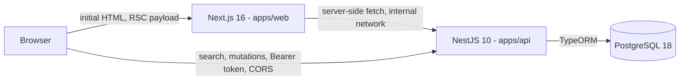
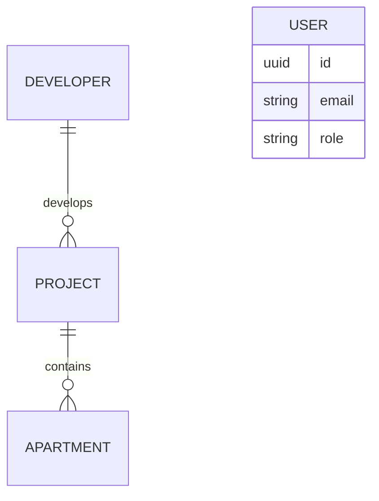

# Requirements — Listing Apartments App

**This document is the single source of truth for scope and behavior.** If code, `AGENTS.md`, or `implementation-plan.md` disagrees with this file, this file wins and the disagreement must be raised rather than silently resolved.

---

## 1. Assignment summary

Build a listing apartments app that lets a user see more details about each apartment.

**Required components:**

| Component | Requirement                                                                                               |
| --------- | --------------------------------------------------------------------------------------------------------- |
| Backend   | Node.js + TypeScript. Endpoints for listing apartments, getting apartment details, and adding apartments. |
| Frontend  | Next.js, responsive for mobile and web, with good UI. Apartment listing page and apartment details page.  |
| Database  | Relational or NoSQL (e.g. PostgreSQL, MongoDB).                                                           |
| Bonus     | Search and filter on the listing page by unit name, unit number, or project.                              |

**Instructions from the assignment:**

- The application must be containerized and run with a **single command** through `docker-compose`, including frontend, backend, and DB.
- Code pushed to a GitHub repository; if private, grant read access to `dev.hiring@nawy.com` (`NawyDevHiring`).
- Document code and API as much as possible.
- Setup/usage instructions must be included.

**Evaluation criteria, in the stated order of importance:**

1. Functionality
2. Code quality
3. Project structure and documentation

This ordering governs every tradeoff in this project. When time is short, a working feature beats a polished one, and a polished one beats an extra one.

---

## 2. Scope

### 2.1 Required scope

- List apartments with pagination
- Get a single apartment's details
- Add an apartment
- Responsive listing page and details page
- PostgreSQL database
- Single-command Docker Compose startup covering web, api, and db

### 2.2 Bonus scope (from the assignment)

- Free-text search across unit name, unit number, and project name
- Filtering, sorting, and pagination on the listing endpoint and page

### 2.3 Explicitly out of scope

Do not implement these without an explicit decision to expand scope:

- File/image upload — images are external URLs only
- Refresh tokens and token rotation — a single access token is enough to demonstrate auth
- Public user registration or any non-ADMIN role
- Internationalization, Arabic content, or RTL layout — English-only, LTR
- Geospatial search, map view, PostGIS
- Real-time updates, WebSockets, push notifications
- Favourites, comparisons, bookings, contact forms, email sending
- Admin dashboard beyond the single add-apartment form
- Caching layer (Redis), message broker, or background job queue

---

## 3. Technology decisions

| Layer          | Choice                                                             |
| -------------- | ------------------------------------------------------------------ |
| Runtime        | Node.js 24.x LTS                                                   |
| Language       | TypeScript, `strict: true`                                         |
| Backend        | NestJS 10.x                                                        |
| ORM            | TypeORM with migrations (never `synchronize: true`)                |
| Database       | PostgreSQL 18 (Alpine image)                                       |
| Frontend       | Next.js 16.x, App Router, React                                    |
| Styling        | Tailwind CSS 4.x + shadcn/ui                                       |
| Repo layout    | npm workspaces monorepo: `apps/api`, `apps/web`, `packages/shared` |
| Auth           | JWT access token, `bcrypt` cost 12                                 |
| API docs       | `@nestjs/swagger` at `/api/docs`                                   |
| Backend tests  | Jest + Supertest against a real PostgreSQL instance                |
| Frontend tests | Vitest + React Testing Library; Playwright for E2E                 |
| Containers     | Docker Compose, Alpine base images wherever available              |

Exact patch versions are pinned in each `package.json` at install time. Do not add a dependency that is not listed here without approval.

**Accepted risk:** `npm audit` reports 3 high-severity findings (`multer`, `picomatch`, and `@nestjs/platform-express` itself) that are only fixable by bumping NestJS 10.x to 11.x. This is a deliberate decision to stay on the pinned version rather than take an unplanned major upgrade: `multer`'s CVEs are all denial-of-service via malicious multipart file uploads, and section 2.3 explicitly puts file upload out of scope — the vulnerable code path is never wired up, so it is not reachable attack surface in this application. All other vulnerabilities reachable through the pinned versions (`glob`, `tmp`, `webpack`, all confined to `@nestjs/cli`'s build-time tooling) are resolved via `overrides` in the root `package.json`.

---

## 4. Architecture



- Server Components render the first paint of the listing and details pages by fetching the API server-side over the internal Docker network.
- Interactive search, filtering, pagination, login, and mutations are browser-direct calls to the API with CORS enabled against an explicit origin allowlist.
- The access token lives client-side and is sent as `Authorization: Bearer <token>`. There is no cookie session and no Next.js middleware guard; the add-apartment route is guarded client-side.

**Backend layering, strictly one-directional:**

```
Controller  ->  Service  ->  Repository  ->  TypeORM / PostgreSQL
```

- Controllers handle HTTP only: routing, validation wiring, status codes, Swagger decorators. No business logic.
- Services own all business rules and are the only layer allowed to call repositories.
- Repositories own all query construction. No query building anywhere else.
- Entities never cross the HTTP boundary. Responses are always DTOs produced by an explicit mapper.

---

## 5. Data model

Four entities. All timestamps are `timestamptz`. All primary keys are UUID v4. All column names are `snake_case` in the database via a naming strategy; TypeScript stays `camelCase`.

### 5.1 `developers`

| Field         | Type         | Constraints                                            |
| ------------- | ------------ | ------------------------------------------------------ |
| `id`          | uuid         | PK                                                     |
| `name`        | varchar(120) | not null; unique among rows where `deleted_at is null` |
| `description` | text         | nullable                                               |
| `logoUrl`     | varchar(500) | nullable; must be http/https if present                |
| `createdAt`   | timestamptz  | not null, default now                                  |
| `updatedAt`   | timestamptz  | not null, auto-updated                                 |
| `deletedAt`   | timestamptz  | nullable                                               |

### 5.2 `projects`

A project is a compound or development containing many units.

| Field         | Type         | Constraints                                           |
| ------------- | ------------ | ----------------------------------------------------- |
| `id`          | uuid         | PK                                                    |
| `name`        | varchar(150) | not null                                              |
| `developerId` | uuid         | FK to `developers.id`, not null, `ON DELETE RESTRICT` |
| `city`        | varchar(100) | not null                                              |
| `district`    | varchar(100) | not null                                              |
| `description` | text         | nullable                                              |
| `createdAt`   | timestamptz  | not null, default now                                 |
| `updatedAt`   | timestamptz  | not null, auto-updated                                |
| `deletedAt`   | timestamptz  | nullable                                              |

Unique: `(developer_id, name) where deleted_at is null`.

Location lives here rather than on the apartment, because every unit in a compound shares it. This is the normalization the model was chosen for.

### 5.3 `apartments`

| Field         | Type                    | Constraints                                                             |
| ------------- | ----------------------- | ----------------------------------------------------------------------- |
| `id`          | uuid                    | PK                                                                      |
| `unitName`    | varchar(150)            | not null                                                                |
| `unitNumber`  | varchar(50)             | not null                                                                |
| `projectId`   | uuid                    | FK to `projects.id`, not null, `ON DELETE RESTRICT`                     |
| `description` | text                    | nullable                                                                |
| `price`       | numeric(14,2)           | not null, `> 0`, currency EGP                                           |
| `bedrooms`    | smallint                | not null, `>= 0`                                                        |
| `bathrooms`   | smallint                | not null, `>= 0`                                                        |
| `areaSqm`     | numeric(8,2)            | not null, `> 0`                                                         |
| `floor`       | smallint                | nullable                                                                |
| `address`     | varchar(255)            | nullable                                                                |
| `status`      | enum `apartment_status` | not null, default `AVAILABLE`, one of `AVAILABLE` / `RESERVED` / `SOLD` |
| `amenities`   | text[]                  | not null, default `{}`                                                  |
| `imageUrls`   | text[]                  | not null, default `{}`; each must be http/https                         |
| `createdAt`   | timestamptz             | not null, default now                                                   |
| `updatedAt`   | timestamptz             | not null, auto-updated                                                  |
| `deletedAt`   | timestamptz             | nullable                                                                |

**Indexes:**

- `unique (project_id, unit_number) where deleted_at is null` — a soft-deleted unit must not block reusing its number
- `gin (unit_name gin_trgm_ops)` and `gin (unit_number gin_trgm_ops)` for case-insensitive partial search (requires the `pg_trgm` extension)
- `btree (price)`, `btree (bedrooms)`, `btree (status)`, `btree (project_id)`, `btree (created_at desc)`

`price` is `numeric`, never a float, because money must not carry binary rounding error. It is serialized to JSON as a **number**: the maximum representable value here is under 10^12, well inside the exact-integer range of an IEEE-754 double once scaled by 100, so no precision is lost across the wire.

### 5.4 `users`

| Field          | Type             | Constraints                        |
| -------------- | ---------------- | ---------------------------------- |
| `id`           | uuid             | PK                                 |
| `email`        | varchar(255)     | not null, unique, stored lowercase |
| `passwordHash` | varchar(255)     | not null, bcrypt cost 12           |
| `role`         | enum `user_role` | not null, currently only `ADMIN`   |
| `createdAt`    | timestamptz      | not null, default now              |
| `updatedAt`    | timestamptz      | not null, auto-updated             |

No soft delete: there is exactly one seeded operator account and no user management surface.



---

## 6. Business rules

Numbered so that tests, commit messages, and PR descriptions can cite them directly.

**Structure and integrity**

- **BR-1** An apartment belongs to exactly one project; a project belongs to exactly one developer.
- **BR-2** On create and update, `projectId` must reference an existing, non-soft-deleted project. Violation returns **422**.
- **BR-3** `unitNumber` must be unique within a project among non-soft-deleted apartments. Violation returns **409**. Enforced by the partial unique index in the database _and_ checked in the service to produce a readable message; the index is the authority.
- **BR-4** A developer or project that still has non-deleted children cannot be hard-deleted (`ON DELETE RESTRICT`).

**Soft delete**

- **BR-5** Every read excludes rows where `deletedAt is not null`, at every layer, with no exceptions exposed through the API.
- **BR-6** `DELETE` sets `deletedAt` and returns **204**. Deleting an already-deleted or non-existent apartment returns **404**.
- **BR-7** A soft-deleted apartment's `unitNumber` becomes available for reuse within its project.

**Search, filter, sort, paginate**

- **BR-8** `q` is a case-insensitive partial match against `unitName`, `unitNumber`, or the parent project's `name`. The three are OR-ed together.
- **BR-9** All other filters are AND-ed with each other and with `q`.
- **BR-10** A `q` that is empty or whitespace-only is ignored rather than matching nothing.
- **BR-11** `limit` defaults to 12 and is capped at 50. `page` defaults to 1. `totalPages` is `ceil(total / limit)`, and is `0` when `total` is `0`.
- **BR-12** A `page` beyond the last page returns **200** with an empty `data` array and accurate `meta`. It is not a 404.
- **BR-13** Default sort is `createdAt:desc`. Allowed values are `createdAt:desc`, `createdAt:asc`, `price:asc`, `price:desc`, `areaSqm:asc`, `areaSqm:desc`.
- **BR-14** `minPrice` must not exceed `maxPrice`. Violation returns **400**.

**Values**

- **BR-15** `price > 0`, `areaSqm > 0`, `bedrooms >= 0`, `bathrooms >= 0`. All prices are EGP; no currency field and no conversion.
- **BR-16** `status` defaults to `AVAILABLE` on create.
- **BR-17** Every entry in `imageUrls` must be a valid `http`/`https` URL. An empty array is valid; the frontend renders a placeholder.

**Auth and security**

- **BR-18** `GET` endpoints are public. `POST`, `PATCH`, and `DELETE` on apartments require a valid access token belonging to an `ADMIN` user.
- **BR-19** A missing or invalid token returns **401**. A valid token without the `ADMIN` role returns **403**.
- **BR-20** Access token expiry is 1 hour. There is no refresh token; the client re-authenticates.
- **BR-21** `passwordHash` is never included in any response, log line, or error message.
- **BR-22** Login returns an identical error for an unknown email and a wrong password, so the endpoint does not disclose which accounts exist.
- **BR-23** Unknown query parameters and unknown body properties are rejected with **400** (`whitelist` plus `forbidNonWhitelisted`).

---

## 7. API contract

Base path: `/api/v1`. All request and response bodies are JSON. **This contract is frozen; changing it requires updating this section first.**

### 7.1 Response conventions

Collections are wrapped:

```json
{
  "data": [{ "...": "resource" }],
  "meta": { "page": 1, "limit": 12, "total": 40, "totalPages": 4 }
}
```

Single resources are returned bare, with no wrapper.

`GET /projects` (7.7) and `GET /developers` (7.8) are explicitly not paginated, so they use the collection wrapper without pagination `meta`: `{ "data": [{ "...": "resource" }] }`.

Errors always use this shape:

```json
{
  "statusCode": 422,
  "message": "Project 3f1c... does not exist",
  "error": "Unprocessable Entity",
  "timestamp": "2026-08-18T20:15:00.000Z",
  "path": "/api/v1/apartments"
}
```

`message` is a string, or an array of strings for validation failures.

### 7.2 `GET /api/v1/apartments`

Public. Lists non-deleted apartments.

| Param       | Type    | Default          | Rules                                   |
| ----------- | ------- | ---------------- | --------------------------------------- |
| `q`         | string  | —                | 1–100 chars, trimmed. Matches per BR-8. |
| `projectId` | uuid    | —                | Must be a valid UUID.                   |
| `minPrice`  | number  | —                | `>= 0`                                  |
| `maxPrice`  | number  | —                | `>= 0`, `>= minPrice`                   |
| `bedrooms`  | integer | —                | `>= 0`, exact match                     |
| `status`    | enum    | —                | `AVAILABLE` / `RESERVED` / `SOLD`       |
| `sort`      | enum    | `createdAt:desc` | See BR-13                               |
| `page`      | integer | `1`              | `>= 1`                                  |
| `limit`     | integer | `12`             | 1–50                                    |

Each item is an `ApartmentListItem`: `id`, `unitName`, `unitNumber`, `price`, `bedrooms`, `bathrooms`, `areaSqm`, `status`, first image as `coverImageUrl`, and a nested `project` of `{ id, name, city, district }`.

Responses: **200**, **400** (invalid params).

### 7.3 `GET /api/v1/apartments/:id`

Public. Returns the full `ApartmentDetail`: every apartment field plus a nested `project` including its `developer` (`{ id, name, logoUrl }`).

Responses: **200**, **400** (malformed UUID), **404** (missing or soft-deleted).

### 7.4 `POST /api/v1/apartments`

ADMIN only. Body:

| Field         | Required | Rules                                  |
| ------------- | -------- | -------------------------------------- |
| `unitName`    | yes      | 1–150 chars                            |
| `unitNumber`  | yes      | 1–50 chars                             |
| `projectId`   | yes      | uuid, must exist (BR-2)                |
| `price`       | yes      | number `> 0`, max 2 decimals           |
| `bedrooms`    | yes      | integer `>= 0`                         |
| `bathrooms`   | yes      | integer `>= 0`                         |
| `areaSqm`     | yes      | number `> 0`                           |
| `description` | no       | up to 5000 chars                       |
| `floor`       | no       | integer                                |
| `address`     | no       | up to 255 chars                        |
| `status`      | no       | enum, defaults `AVAILABLE`             |
| `amenities`   | no       | array of strings, max 30 items         |
| `imageUrls`   | no       | array of http/https URLs, max 12 items |

Responses: **201** with the created `ApartmentDetail`, **400**, **401**, **403**, **409** (BR-3), **422** (BR-2).

### 7.5 `PATCH /api/v1/apartments/:id`

ADMIN only. Any subset of the `POST` fields; at least one must be present. Same validation and the same 409/422 rules.

Responses: **200** with the updated `ApartmentDetail`, **400**, **401**, **403**, **404**, **409**, **422**.

### 7.6 `DELETE /api/v1/apartments/:id`

ADMIN only. Soft delete per BR-6.

Responses: **204**, **401**, **403**, **404**.

### 7.7 `GET /api/v1/projects`

Public. Returns all non-deleted projects for the filter dropdown: `id`, `name`, `city`, `district`, `developer: { id, name }`, and `apartmentCount`. Not paginated; the set is small and bounded.

### 7.8 `GET /api/v1/developers`

Public. Returns all non-deleted developers: `id`, `name`, `logoUrl`, `projectCount`. Not paginated.

### 7.9 `POST /api/v1/auth/login`

Public. Body `{ email, password }`. Returns `{ accessToken, expiresIn, user: { id, email, role } }`.

Responses: **200**, **400**, **401** (BR-22), **429** (rate limited).

### 7.10 `GET /api/v1/auth/me`

Requires a valid token. Returns `{ id, email, role }` so the client can verify a stored token is still valid on load.

Responses: **200**, **401**.

### 7.11 `GET /health`

Public, outside the versioned prefix. Reports process and database status for Docker healthchecks.

Responses: **200**, **503**.

---

## 8. Frontend requirements

### 8.1 Pages

| Route              | Rendering                                               | Contents                                                                                              |
| ------------------ | ------------------------------------------------------- | ----------------------------------------------------------------------------------------------------- |
| `/`                | Server Component first paint, client-side interactivity | Apartment listing: search input, filters, sort, pagination, responsive card grid                      |
| `/apartments/[id]` | Server Component                                        | Details: image gallery, price, specification grid, description, amenities, project and developer info |
| `/apartments/new`  | Client, guarded                                         | Add-apartment form, ADMIN only                                                                        |
| `/login`           | Client                                                  | Email and password form                                                                               |

### 8.2 Behavior

- Search input is debounced at 400ms and writes to the URL query string, so every result set is shareable, bookmarkable, and survives a refresh or back-navigation.
- Filter, sort, and page state also live in the URL. The URL is the single source of UI state.
- Loading states use skeletons matching the final layout, not spinners, to avoid layout shift.
- Empty results, request failures, and 404s each have a distinct, explicit state. A failed fetch must never render as an empty list.
- Prices are formatted as EGP with thousands separators.
- Apartments without images fall back to a placeholder.

### 8.3 Responsiveness

Must be usable and visually correct from 320px upward. Card grid targets one column on mobile, two at `md`, three at `lg`, four at `xl`. Filters collapse behind a disclosure on mobile. No horizontal scrolling at any width. Touch targets are at least 44px.

---

## 9. Non-functional requirements

- **Single command.** `docker compose up` from a fresh clone brings up db, api, and web, applies migrations, seeds data, and yields a browsable app with no further steps. `depends_on` uses `condition: service_healthy`, not mere container existence.
- **Alpine images** wherever an official Alpine variant exists.
- **Strict TypeScript** everywhere. No `any`, no non-null assertions to silence the compiler, no `@ts-ignore` without a comment explaining the constraint.
- **Validation at every boundary.** All external input validated before it reaches a service. Environment variables validated at boundaries too, so the process fails fast on misconfiguration rather than at first request.
- **Rate limiting.** 100 requests/minute globally; 5 requests/minute on `POST /auth/login`.
- **Structured JSON logging** with a per-request correlation ID. Never log secrets, tokens, or password hashes.
- **Graceful shutdown** on `SIGTERM`: stop accepting connections, drain in-flight requests, close the pool.
- **Seed data** is Egyptian and realistic (New Cairo, Sheikh Zayed, Madinaty; developers such as Palm Hills and SODIC), roughly 5 developers, 10 projects, and 40 apartments, priced in EGP. Seeding is idempotent and safe to re-run.

---

## 10. Definition of done

The project is complete when all of the following are true:

- [ ] `docker compose up` on a fresh clone produces a working, populated app with no manual steps
- [ ] All ten API endpoints in section 7 behave exactly as specified, including every listed status code
- [ ] Search, all filters, sorting, and pagination work together in combination, not just individually
- [ ] Listing and details pages are correct and usable from 320px to desktop
- [ ] Every endpoint has an integration test; every business rule in section 6 has a test citing its BR number
- [ ] No skipped or commented-out tests
- [ ] Swagger UI is reachable at `/api/docs` and documents every endpoint, including error responses
- [ ] Lint, typecheck, and the full test suite pass in CI
- [ ] README setup instructions have been followed literally from a fresh clone and verified to work
- [ ] README documents the omissions in section 2.3
